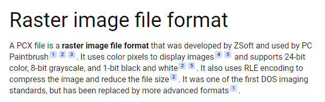

Use:
- https://www.codeandweb.com/texturepacker
- https://phaser.io/download/stable
- https://forums.civfanatics.com/threads/how-to-modify-pcx-files-with-mspaint.417409/
GIMP
- https://www.codeandweb.com/physicseditor/tutorials/how-to-create-physics-shapes-for-phaser-3-and-matterjs
